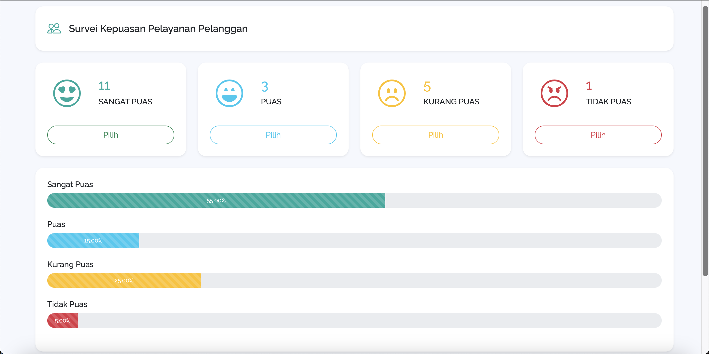

# Aplikasi Survei Kepuasan Pelayanan Pelanggan

Aplikasi berbasis web yang digunakan untuk melakukan survei kepuasan pelayanan pelanggan, sehingga perusahaan atau instansi dapat mencapai kinerja yang efektif dan efisien dalam melayani pelanggan.

Pada aplikasi survei kepuasan pelayanan pelanggan ini terdapat 4 kriteria penilaian, yaitu **Sangat Puas**, **Puas**, **Kurang Puas**, dan **Tidak Puas**.
Data survei disajikan dalam bentuk dashboard yang menampilkan jumlah data dan **progress bars** dari masing-masing kriteria penilaian.
Selain itu disediakan juga tombol **Reset** untuk mengatur ulang data survei.
